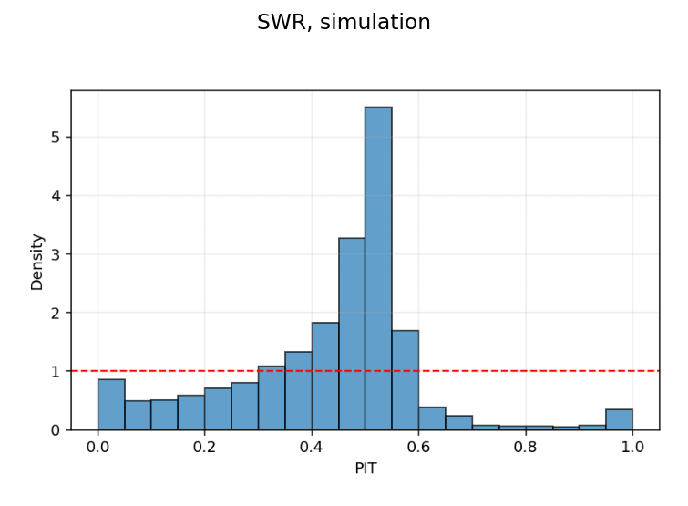
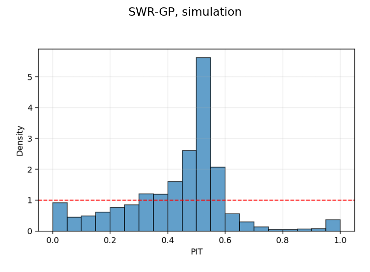
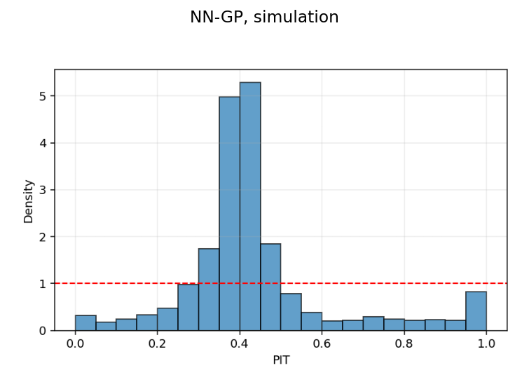
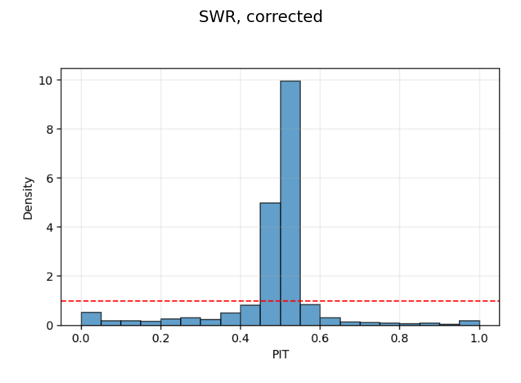
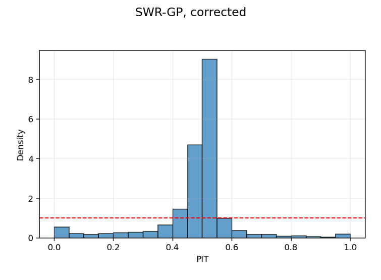
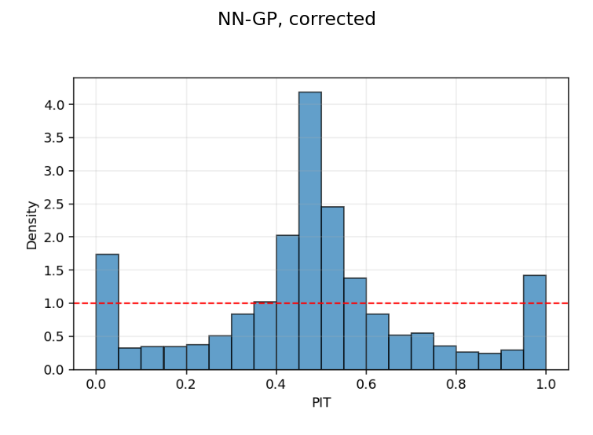

```{python}
#| label: setup-metrics
#| include: false

import json
from pathlib import Path

_exp = Path("..") / "experiments"

def _load(name):
    p = _exp / name / "output" / "results.json"
    with open(p) as f:
        return json.load(f)

S = _load("exp_swr_none")
G = _load("exp_swr_gp_none")
N = _load("exp_nn_gp_none")

def met(exp, mode, metric):
    return exp["best"]["metrics"][mode][metric]

def th(exp, i):
    return exp["best"]["theta"][i]

def cal(exp, mode, stat):
    return exp["best"]["diagnostics"]["calibration"][mode][stat]

def f0(x): return f"{x:.0f}"
def f1(x): return f"{x:.1f}"
def f2(x): return f"{x:.2f}"
def f3(x): return f"{x:.3f}"

# Derived quantities
gpkr_phi = th(G, 1)
gpkr_nsr = th(G, 3) / (th(G, 0) + th(G, 3))
crps_gap_n = abs(met(G, 'krig_test', 'CRPS') - met(S, 'krig_test', 'CRPS'))
swr_s2k_pct = 100 * (1 - met(S, 'krig_test', 'CRPS') / met(S, 'sim_test', 'CRPS'))
gpkr_s2k_pct = 100 * (1 - met(G, 'krig_test', 'CRPS') / met(G, 'sim_test', 'CRPS'))

# --- Simulation recovery grid ---
_sim_path = _exp / "exp_simulation_recovery" / "output" / "simulation_recovery_grid.json"
with open(_sim_path) as _f:
    SIM = json.load(_f)

sim_cfg = SIM["config"]
sim_tbl = SIM["summary_table"]

def sim_cell(K, tier):
    """Look up a cell from the summary table."""
    return next(r for r in sim_tbl if r["K_true"] == K and r["noise_tier"] == tier)

# Convenience aggregates for prose
sim_K_vals = sim_cfg["K_values"]
sim_tiers = list(sim_cfg["snr_tiers"].keys())
sim_max_nrmse = max(r["nrmse_median"] for r in sim_tbl)
sim_max_lag_err = max(r["lag_rel_error_median"] for r in sim_tbl)
sim_min_nse_gap = min(r["nse_max"] - r["nse_median"] for r in sim_tbl)
sim_max_nse_gap = max(r["nse_max"] - r["nse_median"] for r in sim_tbl)
sim_best_nrmse = min(sim_tbl, key=lambda r: r["nrmse_median"])
sim_worst_nrmse = max(sim_tbl, key=lambda r: r["nrmse_median"])
sim_best_nse = max(sim_tbl, key=lambda r: r["nse_median"])
sim_worst_nse = min(sim_tbl, key=lambda r: r["nse_median"])
sim_max_delta_mae = max(r["delta_mae_mean"] for r in sim_tbl)
sim_max_sigma_mae = max(r["sigma_k_mae_mean"] for r in sim_tbl)
sim_max_beta_mae = max(r["beta_mae_mean"] for r in sim_tbl)
sim_max_cov_sigma_mae = max(r["cov_sigma_sq_mae_mean"] for r in sim_tbl)
sim_max_cov_phi_mae = max(r["cov_phi_mae_mean"] for r in sim_tbl)
sim_max_cov_tau_mae = max(r["cov_tau_sq_mae_mean"] for r in sim_tbl)
```

# Introduction

Hydrological time series forecasting has many applications in water resource planning, flood and drought preparedness, and inference about watershed dynamics. In rainfall--runoff modeling, streamflow is the combined effect of several latent subprocesses (overland flow, baseflow), each responding to rainfall on its own delay scale. The Sliding Window Regression (SWR) model captures this structure by representing each subprocess through a kernelized lag profile and combining the resulting predictors linearly, producing a model that is both predictive and hydrologically interpretable [@Schrunner2023].

Residuals from SWR fits retain substantial temporal dependence. When this dependence is handled only through the Cochrane--Orcutt autoregressive (AR) correction [@CochraneOrcutt1949], the boundary between hydrological signal and dependence adjustment blurs. This paper takes a different route, adapting the Neural Network Generalized Least Squares (NN-GLS) framework of Zhan and Datta [@ZhanDatta2024] from its original geostatistical setting to the temporal domain. The central idea is to preserve the interpretable SWR mean function while replacing the residual correction with a sparse temporal Gaussian process (GP) covariance model.

Modeling temporal dependence in the covariance layer, rather than folding it back into the mean equation, is the core contribution of this paper because it preserves the hydrological interpretation of SWR while giving autocorrelation an explicit stochastic model. Section 2 explains why post hoc AR residual corrections leave the mean and dependence components only partially separated in SWR. Section 3 reviews the NN-GLS framework and the NNGP approximation that make estimation computationally feasible. Section 4 develops the temporal SWR-GP model, its parameterization, and the iterative estimation procedure used in practice. Section 5 evaluates the method in a controlled simulation study, and on the Big Sur record, with emphasis on parameter recovery and probabilistic assessment. Section 6 discusses the implications of the results for hydrological modeling, calibration, limitations, and possible extensions. Section 7 concludes.

# Autocorrelation Bottleneck in Hydrological Modeling

Let $x_t$ and $y_t$ denote rainfall and streamflow at time $t$. In the SWR framework, each latent runoff component $k \in \{1,\ldots,K\}$ is represented by a lag kernel $\kappa_{k,\cdot}$ applied to the rainfall history, so that
$$
X_t^{(k)} = \sum_{s=0}^{L} \kappa_{k,s} x_{t-s}, \qquad
\widetilde{y}_t = \sum_{k=1}^{K} \beta_k X_t^{(k)}.
$$
The mean function $\widetilde{y}_t$ therefore decomposes streamflow into a small number of delayed rainfall responses, each with its own weight and lag profile. In the Gaussian specification used here, the $k$-th kernel is centered at lag $\delta_k$ with spread $\sigma_k$, so the parameters retain a direct hydrological interpretation in terms of response timing and temporal dispersion.

Figure @fig-swr-three-kernel gives a stylized $K=3$ example with fast, intermediate, and slow runoff components.

```{python}
#| label: fig-swr-three-kernel
#| fig-cap: "Stylized SWR example with three kernels. Left: three Gaussian lag kernels with distinct centers and spreads. Right: the corresponding weighted component responses and their sum for a simple rainfall sequence."
#| fig-width: 10.8
#| fig-height: 4.5

import numpy as np
import matplotlib.pyplot as plt

lags = np.arange(0, 46)
delta = np.array([4.0, 12.0, 25.0])
spread = np.array([2.4, 4.8, 7.0])
beta = np.array([0.85, 0.55, 0.35])
labels = ["Fast", "Intermediate", "Slow"]
colors = ["#1b9e77", "#d95f02", "#7570b3"]

kernels = []
for d, s in zip(delta, spread):
    k = np.exp(-0.5 * ((lags - d) / s) ** 2)
    k /= k.sum()
    kernels.append(k)
kernels = np.vstack(kernels)

n = 120
rain = np.zeros(n)
rain[[8, 24, 58, 82, 101]] = [16.0, 30.0, 20.0, 36.0, 18.0]

components = np.vstack([
    beta[k] * np.convolve(rain, kernels[k], mode="full")[:n]
    for k in range(3)
])
total = components.sum(axis=0)
t = np.arange(n)

fig, axes = plt.subplots(1, 2, figsize=(10.8, 4.5), dpi=140)

for k in range(3):
    axes[0].plot(lags, kernels[k], lw=2.3, color=colors[k], label=labels[k])
axes[0].set_xlabel("Lag (days)")
axes[0].set_ylabel("Kernel weight")
axes[0].set_title("Lag kernels")
axes[0].set_xlim(0, 45)
axes[0].grid(alpha=0.22)
axes[0].legend(frameon=False, fontsize=9)

rain_ax = axes[1].twinx()
rain_ax.bar(t, rain, width=0.85, color="#bdbdbd", alpha=0.55)
for k in range(3):
    axes[1].plot(t, components[k], lw=2.0, color=colors[k], label=f"{labels[k]} component")
axes[1].plot(t, total, lw=2.8, color="black", label="Total mean")
axes[1].set_xlabel("Time (days)")
axes[1].set_ylabel("Contribution to mean flow")
rain_ax.set_ylabel("Rainfall")
axes[1].set_title("Weighted component responses")
axes[1].set_xlim(0, n - 1)
axes[1].grid(alpha=0.22)
axes[1].legend(frameon=False, fontsize=8, loc="upper right")

plt.tight_layout(pad=0.8)
plt.show()
```

Even when SWR explains a substantial share of the rainfall--runoff signal, the residual process retains marked temporal dependence. Storage effects, recession dynamics, omitted state variables, and unresolved heterogeneity all generate serially correlated departures from the mean equation. Ignoring that dependence distorts uncertainty quantification and attributes part of the residual persistence to the mean structure.

The SWR model corrects for the departure by treating the fitted residuals $\hat r_t = y_t - \hat{\widetilde y}_t$ as AR and modeling them as
$$
\hat r_t = \sum_{j=1}^{p}\phi_j \hat r_{t-j} + u_t,
$$
where $u_t$ is taken to be serially uncorrelated. In this formulation, the SWR mean parameters are estimated first, and the AR coefficients are then estimated from the residual series. The order $p$ is selected progressively over a bounded candidate set by requiring the fitted innovations to exhibit reduced serial dependence. The resulting corrected predictor for one step ahead has the form
$$
\hat y_t^{\mathrm{AR}} = \hat{\widetilde y}_t + \sum_{j=1}^{\hat p}\hat\phi_j\bigl(y_{t-j}-\hat{\widetilde y}_{t-j}\bigr), \qquad t>\hat p.
$$

The AR correction is effective as a residual adjustment, but the dependence parameters are tied to a post hoc regression rather than an explicit covariance model, so the mean and dependence components remain only partially separated and interpretable.

# A Geostatistical Blueprint for Modeling Error Dependence

The NN-GLS framework of Zhan and Datta provides the methodological foundation to address the challenge presented in Section 2. A flexible mean estimator is embedded within a GP covariance model for spatially referenced data. Consider observations at spatial locations $s_1,\ldots,s_n$, with response $Y_i = Y(s_i)$, covariates $\mathbf{X}_i = \mathbf{X}(s_i) \in \mathbb{R}^d$, and $\mathbf{Y} = (Y_1,\ldots,Y_n)^\top$. The data generating process is
$$
Y(s) = f(\mathbf{X}(s)) + \epsilon(s), \qquad \epsilon(\cdot) \sim \mathrm{GP}(0, \Sigma(\cdot,\cdot)),
$$ {#eq-gp-model}
so that the joint likelihood is
$$
(\mathbf{Y} \mid \mathbf{X}) \sim \mathcal{N}\bigl(\mathbf{f}(\mathbf{X}),\, \boldsymbol{\Sigma}\bigr),
$$ {#eq-gp-likelihood}
where $\mathbf{f}(\mathbf{X}) = (f(\mathbf{X}_1),\ldots,f(\mathbf{X}_n))^\top$ and $\boldsymbol{\Sigma} = \boldsymbol{\Sigma}(\boldsymbol{\theta})$ is the $n \times n$ covariance matrix parameterized by $\boldsymbol{\theta}$. This formulation separates the covariate effect (through $f$) from the spatial dependence (through $\boldsymbol{\Sigma}$), enabling kriging at new locations without sacrificing interpretability.

When the error process is spatially correlated, estimating $f$ by ordinary least squares (OLS) ignores the dependence and leads to inefficient estimates. Zhan and Datta instead minimize the generalized least squares (GLS) loss
$$
\mathcal{L}_{\mathrm{GLS}}(f) = \frac{1}{n}\bigl(\mathbf{Y} - \mathbf{f}(\mathbf{X})\bigr)^\top \mathbf{Q} \bigl(\mathbf{Y} - \mathbf{f}(\mathbf{X})\bigr),
$$ {#eq-gls-loss}
where $\mathbf{Q}$ is a working precision matrix, ideally equal to $\boldsymbol{\Sigma}^{-1}$. When $\mathbf{Q} = \boldsymbol{\Sigma}^{-1}$, minimizing @eq-gls-loss is equivalent to maximum likelihood estimation of $f$ under the Gaussian process model @eq-gp-likelihood.

Factoring $\mathbf{Q} = \mathbf{A}^\top\mathbf{A}$ and defining $\mathbf{Y}^* = \mathbf{A}\mathbf{Y}$ and $\mathbf{f}^*(\mathbf{X}) = \mathbf{A}\mathbf{f}(\mathbf{X})$ reduces the GLS loss to OLS on decorrelated data:
$$
\mathcal{L}_{\mathrm{GLS}}(f) = \frac{1}{n}\bigl(\mathbf{Y}^* - \mathbf{f}^*(\mathbf{X})\bigr)^\top \bigl(\mathbf{Y}^* - \mathbf{f}^*(\mathbf{X})\bigr).
$$ {#eq-gls-decorrelated}


Full GP inference requires $O(n^3)$ time and $O(n^2)$ storage, which is infeasible for even moderately large datasets. Zhan and Datta employ the Nearest Neighbor Gaussian Process (NNGP) approximation [@Datta2016], which replaces the dense precision matrix with a sparse conditional factorization.

Given a directed acyclic graph (DAG) over the $n$ locations, let $N(i)$ denote the neighbor set of location $s_i$, with $|N(i)| \leq m \ll n$. For each index $i$, the conditional distribution of $Y_i$ given its neighbors $\mathbf{Y}_{N(i)}$ under the full GP yields the kriging coefficients
$$
\mathbf{b}_i = \boldsymbol{\Sigma}_{N(i),N(i)}^{-1} \boldsymbol{\Sigma}_{N(i),i},
$$ {#eq-nngp-b}
and the conditional variance
$$
F_i = \boldsymbol{\Sigma}_{ii} - \boldsymbol{\Sigma}_{i,N(i)} \mathbf{b}_i.
$$ {#eq-nngp-F}
Collecting the vectors $\mathbf{b}_i$ into a sparse lower triangular matrix $\mathbf{B}$ (with $B_{i,N(i)} = \mathbf{b}_i^\top$ and zero elsewhere) and the scalars $F_i$ into the diagonal matrix $\mathbf{F} = \operatorname{diag}(F_1,\ldots,F_n)$, the NNGP working precision takes the form
$$
\mathbf{Q} = \widetilde{\boldsymbol{\Sigma}}^{-1} = (\mathbf{I} - \mathbf{B})^\top \mathbf{F}^{-1} (\mathbf{I} - \mathbf{B}).
$$ {#eq-nngp-precision}
This precision matrix is never formed as a dense $n \times n$ object. Each row of $\mathbf{B}$ has at most $m$ nonzero entries and $\mathbf{F}$ is diagonal, so the construction requires only $n$ local solves of dimension $m \times m$, yielding $O(nm^3)$ total cost. The decorrelation map is sequential: for each unit $i$,
$$
Y_i^* = F_i^{-1/2}\bigl(Y_i - \mathbf{b}_i^\top \mathbf{Y}_{N(i)}\bigr),
$$ {#eq-nngp-decorrelate}
which requires $O(nm)$ total work. Sparsity thus enters through local conditional structure rather than through truncation of a dense covariance.

The mean function $f$ in @eq-gp-model does not need to be linear. Zhan and Datta model $f$ with a feedforward neural network and estimate its parameters by minimizing the GLS loss @eq-gls-loss rather than the standard OLS loss. An $L$-layer multilayer perceptron (MLP) maps the input $\mathbf{X}_i$ through hidden layers to produce the output $O_i = f(\mathbf{X}_i)$. NN-GLS minimizes the GLS loss with the NNGP precision, which by the decorrelation equivalence @eq-gls-decorrelated reduces to
$$
\mathcal{L}_{\mathrm{GLS}}(f) = \sum_{i=1}^{n} \bigl(Y_i^* - O_i^*\bigr)^2,
$$ {#eq-nngls-loss}
where $Y_i^* = \mathbf{v}_i^\top \mathbf{Y}_{N^*[i]}$ and $O_i^* = \mathbf{v}_i^\top \mathbf{O}_{N^*[i]}$ are decorrelated responses and outputs, $N^*[i] = \{i\} \cup N(i)$ is the inclusive neighborhood, and the graph convolution weights are
$$
\mathbf{v}_i^\top = F_i^{-1/2}\bigl(1, -\mathbf{b}_i^\top\bigr).
$$ {#eq-graph-weights}
This reveals NN-GLS as a graph neural network on the nearest neighbor DAG: the MLP maps covariates to a predicted mean at each node, and graph convolution layers decorrelate both output and response using kriging weights before OLS comparison [@ZhanDatta2024]. The loss decomposes into a sum over data units, admits minibatching, and supports standard backpropagation. The covariance parameters $\boldsymbol{\theta}$ are updated periodically by maximizing the NNGP log-likelihood
$$
\ell(\boldsymbol{\theta}) = -\tfrac{1}{2}\sum_{i=1}^{n}\Bigl[\bigl(Y_i^*(\boldsymbol{\theta}) - O_i^*(\boldsymbol{\theta})\bigr)^2 + \log F_i(\boldsymbol{\theta})\Bigr],
$$ {#eq-nngp-loglik}
alternating with gradient descent updates of the network weights.

Because NN-GLS retains the GP model structure, predictions at new locations follow from kriging. Given a new location $s_0$ with covariates $\mathbf{X}_0$, the kriging predictor is
$$
\hat{Y}_0 = \hat{f}(\mathbf{X}_0) + \boldsymbol{\Sigma}(s_0, N(0))\,\boldsymbol{\Sigma}(N(0), N(0))^{-1}\bigl(\mathbf{Y}_{N(0)} - \hat{\mathbf{f}}_{N(0)}\bigr),
$$ {#eq-kriging}
with conditional variance $\sigma_0^2 = F_{00}$. The correction adjusts the mean prediction using observed residuals at neighboring locations, improving point forecasts and providing prediction intervals.

Zhan and Datta [-@ZhanDatta2024] establish the first large sample theory for neural network estimators under spatially correlated errors: existence of a GLS minimizer over the neural network sieve, consistency $\|\hat{f}_n - f_0\|_n^2 \xrightarrow{p} 0$ for any continuous $f_0$ under increasing domain asymptotics, and a finite sample error rate governed by the spectral interval of the discrepancy matrix $\mathbf{E} = \boldsymbol{\Sigma}^{1/2}\mathbf{Q}\boldsymbol{\Sigma}^{1/2}$. When $\mathbf{Q}$ approximates $\boldsymbol{\Sigma}^{-1}$ well, $\mathbf{E}$ is near identity and the error rate is near optimal. Ignoring dependence ($\mathbf{Q} = \mathbf{I}$) inflates the spectral interval, directly motivating accurate covariance modeling.


# Temporal SWR-GP: Model Specification and Estimation


Let $y_t$ denote streamflow at time $t \in \{1,\ldots,n\}$, let $x_t$ denote rainfall, and let $X_t^{(1)},\ldots,X_t^{(K)}$ denote the kernelized rainfall predictors defined in Section 2. Writing $\boldsymbol{\beta} = (\beta_1,\ldots,\beta_K)^\top$ and $\widetilde{y}_t = \sum_{k=1}^{K}\beta_k X_t^{(k)}$, the temporal model is
$$
y_t = \widetilde{y}_t + \epsilon_t, \qquad \boldsymbol{\epsilon} = (\epsilon_1,\ldots,\epsilon_n)^\top \sim \mathcal{N}(\mathbf{0},\, \boldsymbol{\Sigma}(\boldsymbol{\theta})),
$$ {#eq-temporal-model}
where the mean function is the SWR linear predictor from Section 2 and the residual process is a zero mean Gaussian process with temporal covariance $\boldsymbol{\Sigma}(\boldsymbol{\theta})$. The mean is linear in $\boldsymbol{\beta}$ for fixed kernel shape parameters, a property exploited in the estimation procedure below.

Residual dependence follows a stationary Matérn covariance [@Matern1960] with nugget:
$$
\Sigma_{tt'} = \sigma^2\, M_\nu\!\left(\frac{|t - t'|}{\phi}\right) + \tau^2 \mathbf{1}_{t = t'},
$$ {#eq-matern}
where $\boldsymbol{\theta} = (\sigma^2, \phi, \nu, \tau^2)$: $\sigma^2$ is the signal variance, $\phi$ the temporal range controlling decorrelation rate, $\nu$ the smoothness, and $\tau^2$ the nugget variance (measurement noise or unresolved microscale variability). Here $M_\nu(r)$ denotes the unit-range Matérn correlation function evaluated at scaled lag $r = |t-t'|/\phi$. The Matérn function has closed form expressions for half integer $\nu$; in the present implementation, $\nu$ is fixed at $1.5$, yielding
$$
M_{3/2}(r) = \left(1 + \sqrt{3}\, r\right)\exp\!\left(-\sqrt{3}\, r\right).
$$ {#eq-matern-15}
This gives a once differentiable process with three free covariance parameters ($\sigma^2$, $\phi$, $\tau^2$). The original NN-GLS framework fixes the exponential covariance ($\nu = 0.5$), standard for rough spatial fields. In the temporal setting, $\nu = 1.5$ is more appropriate: daily streamflow residuals reflect aggregated storage and recession dynamics that are physically smooth on a daily timescale, unlike the nowhere differentiable sample paths implied by $\nu = 0.5$. Estimating $\nu$ continuously would require evaluating the modified Bessel function inside the NNGP inner loop at substantial cost, while providing limited benefit given that the likelihood is dominated by the range and variance ratio.


Scalable inference uses an ordered neighbor NNGP approximation that exploits the natural temporal ordering. For each time $t$, the neighbor set is the $m$ most recent predecessors:
$$
N(t) = \{\, t-j : 1 \leq j \leq \min(t-1, m)\,\}.
$$ {#eq-temporal-neighbors}
The ordering is given by time itself and the neighbor set is deterministic given $m$. The kriging coefficients $\mathbf{b}_t$ and conditional variance $F_t$ are computed from @eq-nngp-F and @eq-nngp-b using the Matérn covariance entries over each neighbor set (with the nugget included on the diagonal). These coefficients define sparse matrices $\mathbf{B}$ and $\mathbf{F} = \operatorname{diag}(F_1,\ldots,F_n)$ as factors in @eq-nngp-precision.

The decorrelated response and design matrix are then
$$
y_t^* = F_t^{-1/2}\Bigl(y_t - \sum_{j \in N(t)} B_{t,j}\, y_j\Bigr), \qquad
X_t^{(k)*} = F_t^{-1/2}\Bigl(X_t^{(k)} - \sum_{j \in N(t)} B_{t,j}\, X_j^{(k)}\Bigr),
$$ {#eq-temporal-decorrelate}
for $k = 1,\ldots,K$. The NNGP construction requires $O(nm^3)$ work and the decorrelation map $O(nmK)$.

For fixed kernel shapes $\boldsymbol{\eta}$ and covariance parameters $\boldsymbol{\theta}$, the mean is linear in $\boldsymbol{\beta}$. Writing $\mathbf{X} = \mathbf{X}(\boldsymbol{\eta})$ for the $n \times K$ design matrix and $\mathbf{X}^*$, $\mathbf{y}^*$ for their decorrelated counterparts, the profiled GLS step becomes the nonnegative least-squares problem
$$
\hat{\boldsymbol{\beta}}(\boldsymbol{\eta}, \boldsymbol{\theta})
  = \arg\min_{\boldsymbol{\beta} \geq \mathbf{0}}
    \|\mathbf{y}^* - \mathbf{X}^*\boldsymbol{\beta}\|_2^2.
$$ {#eq-gls-beta}
If the nonnegativity constraint is inactive, @eq-gls-beta reduces to the usual OLS formula on the whitened data. More generally, it is equivalent to minimizing $(\mathbf{y} - \mathbf{X}\boldsymbol{\beta})^\top \mathbf{Q}\,(\mathbf{y} - \mathbf{X}\boldsymbol{\beta})$ over $\boldsymbol{\beta} \geq \mathbf{0}$ with $\mathbf{Q} = \widetilde{\boldsymbol{\Sigma}}^{-1}$, but the whitened form avoids forming $\mathbf{Q}$ or $\boldsymbol{\Sigma}$ explicitly. The coefficients are constrained to $\boldsymbol{\beta} \geq \mathbf{0}$, reflecting the physical requirement that each runoff weight is nonnegative. When $\mathbf{X}(\boldsymbol{\eta})$ has full column rank, Appendix A shows that the constrained solution is unique. The resulting profiled objective retains only the $2K + 3$ nonlinear parameters $(\boldsymbol{\eta}, \boldsymbol{\theta})$ for iterative optimization.


The full parameter vector consists of $2K$ kernel shape parameters ($\log\delta_k$, $\log\sigma_k$) and three covariance parameters ($\log\sigma^2$, $\log\phi$, $\log\tau^2$), all on log scales with bounded search regions. The objective is the negative GLS log-likelihood:
$$
-\ell(\boldsymbol{\eta}, \boldsymbol{\theta}) = -\left[-\frac{n}{2}\log(2\pi) - \frac{1}{2}\sum_{t=1}^{n}\log F_t - \frac{1}{2}\sum_{t=1}^{n}(y_t^* - \hat{\widetilde y}_t^*)^2\right],
$$ {#eq-neg-log-lik}
where $\hat{\widetilde y}_t^*$ is the decorrelated fitted SWR mean. Each evaluation builds $\mathbf{X}(\boldsymbol{\eta})$, constructs the NNGP factors, decorrelates, and solves for $\hat{\boldsymbol{\beta}}$ via @eq-gls-beta. The optimizer is the Covariance Matrix Adaptation Evolution Strategy (CMA-ES) [@Hansen2003], a derivative free global search suited to the moderate dimensionality and multimodal geometry of the kernel and covariance parameter space. Optimization proceeds over the full $(\boldsymbol{\eta}, \boldsymbol{\theta})$ vector jointly, with $\boldsymbol{\beta}$ profiled out at each evaluation.

Two prediction modes are available: *Simulation (mean prediction),* where given rainfall $x_1,\ldots,x_n$, the design matrix is built from the fitted kernel parameters and the fitted mean prediction is
$$
\hat{\widetilde y}_t = \mathbf{X}_t \hat{\boldsymbol{\beta}},
$$
and *Kriging (conditional mean correction)* that corrects this fitted mean using observed residuals at neighboring time points:
$$
\hat{y}_t^{\mathrm{krig}} = \hat{\widetilde y}_t + \sum_{j \in N(t)} B_{t,j}\, \epsilon_j, \qquad \epsilon_j = y_j - \hat{\widetilde y}_j,
$$ {#eq-kriging-temporal}
Under the ordered-neighbor NNGP working model, the coefficients $\mathbf{b}_t$ give the one-step conditional mean correction based on the $m$ most recent residuals, and $F_t$ is the corresponding conditional variance for Gaussian prediction intervals. Appendix A records the finite-dimensional facts used directly in Section 4: well-posedness of the ordered-neighbor NNGP factors, uniqueness of the constrained GLS update when the design has full column rank, and the conditional mean/variance identity behind @eq-kriging-temporal. A full consistency theorem for the joint profiled temporal estimator is not claimed here.

# Neural Network as a Flexible Mean Function:

To test whether the SWR mean adequately captures the rainfall--streamflow relationship, the same GP covariance framework is paired with a neural network mean function, yielding a temporal adaptation of NN-GLS from Section 3. The input at each time step is a lag vector $\mathbf{z}_t = (x_t, x_{t-1}, \ldots, x_{t-L+1})^\top$ of dimension $L$, and the mean function is an MLP with two hidden layers:
$$
f_{\mathrm{NN}}(\mathbf{z}_t) = \mathbf{w}_3^\top\, g\bigl(\mathbf{W}_2\, g(\mathbf{W}_1 \mathbf{z}_t)\bigr),
$$ {#eq-nn-mean}
where $g(\cdot) = \mathrm{ReLU}(\cdot)$ is applied elementwise. Training follows the iterative NN-GLS scheme: rebuild the NNGP matrices from the current covariance estimate, train the MLP by backpropagation on the decorrelated GLS loss
$$
\mathcal{L} = \frac{1}{n}\sum_{t=1}^{n}\left[F_t^{-1/2}\Bigl(y_t - f_{\mathrm{NN}}(\mathbf{z}_t) - \sum_{j \in N(t)} B_{t,j}\bigl(y_j - f_{\mathrm{NN}}(\mathbf{z}_j)\bigr)\Bigr)\right]^2,
$$ {#eq-nn-gls-loss}
then $\boldsymbol{\theta}$ is reestimated from the updated residuals by NNGP maximum likelihood estimation (MLE). The total epoch budget is divided evenly across GLS iterations. Gradient clipping, early stopping, and $L_2$ regularization stabilize training.

The Neural Network with Gaussian Process (NN-GP; not to be confused with NNGP nearest neighbour approximation algorithm discussed earlier) model is a diagnostic: if it outperforms SWR in test metrics, nonlinear dynamics are present that the kernel convolution cannot capture; if SWR performs comparably, the more interpretable specification is preferred. Both models share the same GP covariance and NNGP machinery, so the comparison isolates mean function flexibility. The NN-GP uses a fixed architecture (no complexity sweep), so no model selection within the neural network family is needed. 

# Empirical Validation

Three experiments test the proposed framework from complementary angles. A simulation study asks whether SWR-GP can recover mean and covariance parameters under controlled data generating conditions. This is the prerequisite for trusting any real data conclusions. An application study then places the GP model against the standard SWR baseline on the Big Sur river catchment record. The question is whether modeling temporal dependence through a GP rather than a post hoc AR correction performs comparably if not better. In the third experiment, a neural network mean function replaces the kernel regression, following the original NN-GLS architecture of @ZhanDatta2024, to probe whether additional mean function flexibility genuinely helps or whether the GP residual layer compensates for a weaker mean by overfitting the training data. Calibration and residual diagnostics for the test fits are reported in Appendix B.

The simulation experiment uses the first ten years of the Big Sur training rainfall record as the covariate input, giving `{python} f"{sim_cfg['n_points']:,}"` daily observations. The design is a $4 \times 3$ factorial grid: true kernel complexity $K \in \{1,2,3,4\}$ crossed with signal to noise ratio (SNR) tiers $\{100, 20, 5\}$. In each cell, Gaussian kernels are sampled with the same geometric fit constraints used at estimation: centers are separated by at least `{python} f0(sim_cfg['min_mean_lag_separation'])` days, pairwise normalized overlap is capped at `{python} f2(sim_cfg['max_overlap'])`, and each kernel is required to stay inside the admissible lag window under a `{python} f0(sim_cfg['fit_constraints']['support_sigma_multiple'])`-sigma support rule on $[0,90]$. Kernel spreads are sampled from $[2,4]$ days, and component weights satisfy $\beta_k \sim \mathrm{Uniform}(0.10, 0.35)$. Given the resulting mean function realization $\widetilde{y}_t$, the total residual variance is set to $\mathrm{Var}(\mu) / \mathrm{SNR}_{\text{target}}$, split into a Matérn sill and nugget using the fixed `{python} f1(100 * sim_cfg['nugget_fraction'])`\% nugget fraction, with $\phi \sim \mathrm{Uniform}(7,50)$, fixed smoothness `{python} f1(sim_cfg['nu'])`, and `{python} sim_cfg['m']` NNGP neighbors. The synthetic response is generated as $y_t = \widetilde{y}_t + \epsilon_t$ with $\epsilon_t$ drawn by circulant embedding [@WoodChan1994]. The current grid uses `{python} sim_cfg['reps']` replications per cell, and within each replication the oracle model at the true $K$ is fit with the CMA-ES optimizer using `{python} sim_cfg['n_restarts']` restarts and an iteration budget of `{python} sim_cfg['maxiter']`.

Point recovery of the mean is measured by the Nash--Sutcliffe efficiency (NSE; @NashSutcliffe1970), defined as $\mathrm{NSE} = 1 - \mathrm{SS_{res}} / \mathrm{SS_{tot}}$, with the true mean ceiling given by $\mathrm{SNR} / (1 + \mathrm{SNR})$. @fig-sim-nse visualizes the observed NSE and the theoretical maximum given the SNR level. 


```{python}
#| label: fig-sim-nse
#| fig-cap: "Observed NSE across noise tiers for each true kernel count. In each panel, the shaded region is the achieved NSE, the dotted line is the theoretical ceiling implied by the SNR."
#| fig-width: 11.8
#| fig-height: 5

import numpy as np
import matplotlib.pyplot as plt

_tiers = ["low", "medium", "high"]
_tier_labels = ["SNR = 100", "SNR = 20", "SNR = 5"]
_kernel_colors = {1: "#1b9e77", 2: "#d95f02", 3: "#7570b3", 4: "#e7298a"}
_Ks = [1, 2, 3, 4]

fig, axes = plt.subplots(1, 4, figsize=(11.8, 3.5), sharey=True)
_x = np.arange(len(_tiers), dtype=float)

for ax, K in zip(axes, _Ks):
    _achieved = np.array([sim_cell(K, tier)["nse_median"] for tier in _tiers])
    _max = np.array([sim_cell(K, tier)["nse_max"] for tier in _tiers])
    _color = _kernel_colors[K]
    ax.fill_between(_x, _achieved, 0, color=_color, alpha=0.18)
    ax.plot(_x, _achieved, color=_color, lw=2.0, marker="o")
    ax.plot(_x, _max, color=_color, lw=1.7, ls=":")
    ax.set_xticks(_x)
    ax.set_xticklabels(_tier_labels, fontsize=8)
    ax.set_xlabel("Noise tier", fontsize=8.5)
    ax.set_title(f"$K={K}$", fontsize=10)
    ax.grid(True, alpha=0.25)
    ax.set_ylim(0.72, 1.01)

axes[0].set_ylabel("NSE", fontsize=9)
plt.tight_layout(pad=0.8)
plt.show()
```

The completed grid shows strong oracle recovery for $K \leq 3$ and a weaker recoveryat $K=4$. For $K=1$ and $K=2$, median achieved NSE stays very close to the ceiling implied by the SNR in all three noise tiers. The $K=3$ setups are harder but still stable overall, with median NSE between `{python} f3(sim_cell(3, "high")["nse_median"])` and `{python} f3(sim_cell(3, "medium")["nse_median"])`. The main instability is concentrated in the four kernel setups with low noise levels (SNR = 100).

@fig-sim-params reports parameter recovery error using mean absolute error (MAE). For the kernel parameters $\delta_k$, $\sigma_k$, and $\beta_k$, each replication first forms the sum of absolute errors across matched kernel components and averages over $K$, so each matched component contributes one term to the MAE within each replication. The cell summary is the mean of replication MAEs across the five replications. For the covariance parameters $\sigma^2$, $\phi$, and $\tau^2$, each replication contributes one absolute estimation error because each covariance parameter is scalar, and the cell summary is again the mean across the five replications. The parameter panels confirm the same pattern: small errors for $K \leq 3$, and increasing instability concentrated in the $K=4$, SNR = 100 cell. 

```{python}
#| label: fig-sim-params
#| fig-cap: "Parameter recovery heatmaps for the six recovered parameter blocks in the latest oracle simulation run, reported as MAE within each parameter. For $\\delta$, $\\sigma_k$, and $\\beta$, MAE is computed across the matched kernel components within each cell."
#| fig-width: 10.8
#| fig-height: 5.8

import numpy as np
import matplotlib.pyplot as plt

_tiers = ["low", "medium", "high"]
_Ks = [1, 2, 3, 4]
_panels = [
    ("delta_mae_median", r"$\delta$ MAE"),
    ("sigma_k_mae_median", r"$\sigma_k$ MAE"),
    ("beta_mae_median", r"$\beta$ MAE"),
    ("cov_sigma_sq_mae_median", r"$\sigma^2$ MAE"),
    ("cov_phi_mae_median", r"$\phi$ MAE"),
    ("cov_tau_sq_mae_median", r"$\tau^2$ MAE"),
]

fig, axes = plt.subplots(2, 3, figsize=(10.8, 6.2), sharey=True)

for ax, (key, title) in zip(axes.flat, _panels):
    _data = np.array([[sim_cell(K, t)[key] for t in _tiers] for K in _Ks])
    _vmax = max(1e-6, float(np.max(_data)) * 1.05)
    im = ax.imshow(_data, cmap="YlOrRd", vmin=0, vmax=_vmax, aspect="auto")
    plt.colorbar(im, ax=ax, shrink=0.80, pad=0.03)
    ax.set_xticks(range(len(_tiers)))
    ax.set_xticklabels(["Low", "Med", "High"], fontsize=8)
    ax.set_yticks(range(len(_Ks)))
    ax.set_yticklabels([f"$K={k}$" for k in _Ks], fontsize=8.5)
    ax.set_xlabel("Noise tier", fontsize=8.5)
    ax.set_title(title, fontsize=10)
    ax.tick_params(axis="both", length=0)
    for i in range(len(_Ks)):
        for j in range(len(_tiers)):
            v = _data[i, j]
            c = "white" if v > 0.55 * _vmax else "black"
            txt = f"{v:.3f}" if _vmax < 10 else f"{v:.2f}"
            ax.text(j, i, txt, ha="center", va="center", fontsize=8.5, color=c)

axes[0, 0].set_ylabel(r"True $K$", fontsize=9)
axes[1, 0].set_ylabel(r"True $K$", fontsize=9)
plt.tight_layout(pad=0.8)
plt.show()
```

Next, the GP model is compared against the established SWR baseline under the same data split and kernel configuration. The Big Sur river basin's daily rainfall and streamflow record is split so that the first 29 years are used for training ($n_{\text{train}}=10{,}501$) and the last 10 years are kept for testing ($n_{\text{test}}=3{,}652$). All kernel models use Gaussian lag kernels with maximum lag $L = 100$ days. SWR-GP uses $m = 20$ NNGP neighbors. 

Kernel selection uses the Bayesian Information Criterion (BIC): an effective version for SWR and the standard version for SWR-GP,
$$
\mathrm{BIC}_{\mathrm{eff}} = -2\,\ell_{\mathrm{OLS}} + p_{\mathrm{OLS}}\log\!\bigl(\max(n_{\mathrm{eff}}, 2)\bigr),
$$ {#eq-bic-eff}
$$
\mathrm{BIC}_{\mathrm{GLS}} = -2\,\ell_{\mathrm{GLS}} + p_{\mathrm{GLS}}\log(n),
$$ {#eq-bic-gls}
so SWR selects $K \in \{1,2,3,4\}$ by $\mathrm{BIC}_{\mathrm{eff}}$ because its residuals remain autocorrelated, whereas the GP model selects by $\mathrm{BIC}_{\mathrm{GLS}}$ because the GLS likelihood already models temporal dependence.

Both models share the same kernel convolution mean function but differ in how they handle residual dependence. SWR estimates $(\boldsymbol{\beta_k}, \boldsymbol{\delta_k}, \boldsymbol{\sigma_k})$ for all kernels by OLS and corrects residuals with the Cochrane--Orcutt AR predictor described in Section 2. The GP variant estimates $(\boldsymbol{\beta_k}, \boldsymbol{\delta_k}, \boldsymbol{\sigma_k}, \sigma^2, \phi, \tau^2)$ jointly under GLS with the NNGP covariance and corrects residuals by the kriging predictor of @eq-kriging-temporal in Section 4. Because GLS and OLS yield different coefficient estimates when errors are correlated, the two fitted mean functions are not identical even at the same $K$.

SWR selects $K=`{python} S['selection']['best_K']`$ by $\mathrm{BIC}_{\mathrm{eff}}$ (@eq-bic-eff), whereas the GP model selects $K=`{python} G['selection']['best_K']`$ by standard BIC (@eq-bic-gls). The one kernel difference is interpretable: the SWR mean function must capture all predictive signal alone, so it benefits from a fourth kernel, while the GP residual process absorbs some fine temporal structure that the fourth kernel would otherwise provide. Each model reports predictions in two modes. The simulation mode (not to be confused with the controlled simulation experiment at the start of the current section) captures on kernel mean using history of rainfall up to each time point. The corrected mode conditions the response on recently observed streamflow through either the AR adjustment or NNGP kriging, producing forecasts one step ahead that exploit the temporal persistence in the residuals. 

Test performance is assessed with three metrics. NSE measures the fraction of variance explained relative to the observed mean as a constant predictor, with NSE = 1 being perfect and NSE $\leq 0$ indicating no skill. The Kling--Gupta efficiency (KGE; @Gupta2009) decomposes predictive skill into correlation, bias ratio, and variability ratio, penalizing each error source separately. Similar to NSE, KGE = 1 indicates perfect fit. Comparison across model families uses test kriging continuous ranked probability score (CRPS; @GneitingRaftery2007). CRPS is a proper scoring rule for distributional forecasts that reduces to MAE for deterministic predictions. Smaller values indicate sharper and better calibrated forecasts. CRPS is the primary comparison criterion because it simultaneously rewards both point accuracy and calibrated uncertainty, whereas NSE and KGE assess only the mean prediction and do not penalize overconfident or underconfident intervals.

The results are presented in @tbl-metrics. The simulation mode mean functions are nearly indistinguishable: SWR-GP test NSE of `{python} f3(met(G, 'sim_test', 'NSE'))` matches the SWR value of `{python} f3(met(S, 'sim_test', 'NSE'))` within rounding, and simulation CRPS differs by only `{python} f3(abs(met(G, 'sim_test', 'CRPS') - met(S, 'sim_test', 'CRPS')))` cfs. Joint GLS estimation does not meaningfully change the recovered mean function once the kernel count is fixed, which is desirable. After residual correction, SWR retains a slight advantage, partly because it selects $K=`{python} S['selection']['best_K']`$, giving it three more mean parameters than the GP model at $K=`{python} G['selection']['best_K']`$. The fitted Matérn covariance has range $\hat\phi =$ `{python} f1(gpkr_phi)` days and nugget to sill ratio $\hat\tau^2/(\hat\sigma^2 + \hat\tau^2) =$ `{python} f2(gpkr_nsr)`.

To probe non-linearity in mean function, the NN-GP uses a regularized MLP with two hidden layers. The hidden dimension is 24, giving 3,052 total parameters (3,049 network weights plus 3 covariance parameters). The architecture uses no dropout and uses the $L_2$ penalty ($\lambda = 10^{-3}$), which is set a priori. 


```{python}
#| label: tbl-metrics
#| tbl-cap: "Test metrics for all three models. Simulation uses rainfall history only; corrected conditions on past streamflow via AR correction (SWR) or NNGP kriging (SWR-GP, NN-GP). $K$: selected number of kernels (not applicable for NN-GP); CRPS in cfs; NSE and KGE dimensionless."
#| output: asis

from IPython.display import display, Latex

_rows = [
    ("SWR",    str(S['selection']['best_K']), S),
    ("SWR-GP", str(G['selection']['best_K']), G),
    ("NN-GP",  r"\text{---}",                 N),
]

_body = "\n".join(
    f"  {nm} & ${ks}$ & "
    f"{f3(met(ex,'sim_test','NSE'))} & "
    f"{f3(met(ex,'sim_test','KGE'))} & "
    f"{f3(met(ex,'sim_test','CRPS'))} & "
    f"{f3(met(ex,'krig_test','NSE'))} & "
    f"{f3(met(ex,'krig_test','KGE'))} & "
    f"{f3(met(ex,'krig_test','CRPS'))} \\\\"
    for nm, ks, ex in _rows
)

_tex = r"""
\begin{tabular}{lc rrr rrr}
\toprule
 & & \multicolumn{3}{c}{Simulation} & \multicolumn{3}{c}{Corrected} \\
\cmidrule(lr){3-5} \cmidrule(lr){6-8}
Model & $K$ & NSE & KGE & CRPS & NSE & KGE & CRPS \\
\midrule
""" + _body + r"""
\bottomrule
\end{tabular}
"""

display(Latex(_tex))
```

The simulation columns of @tbl-metrics indicate the cost of abandoning the kernel prior: the network captures only `{python} f0(100 * met(N, 'sim_test', 'NSE'))`% of test variance against `{python} f0(100 * met(S, 'sim_test', 'NSE'))`% for SWR, despite having two orders of magnitude more parameters. Smooth lag profiles and nonnegative runoff weights are structural constraints in the kernel convolution; unconstrained network weights must recover equivalent structure from data alone. After residual correction, the pattern reverses: NN-GP achieves the sharpest corrected CRPS of the three models at `{python} f3(met(N, 'krig_test', 'CRPS'))`, narrowly below SWR (`{python} f3(met(S, 'krig_test', 'CRPS'))`) and SWR-GP (`{python} f3(met(G, 'krig_test', 'CRPS'))`). 


# Discussion

The NN-GLS framework was developed for spatial data, where covariate effects at different locations can be arbitrarily nonlinear, requiring a flexible mean function such as a neural network. In hydrological time series, the covariate structure is more constrained: streamflow responds to rainfall through a small number of delayed pathways, each governed by catchment storage and routing characteristics. The kernel convolution mean already encodes these pathways, and its parameters ($\delta_k$, $\sigma_k$, $\beta_k$) map directly onto response timing, dispersion, and magnitude for each runoff component [@Schrunner2023]. What the original SWR framework lacks is a principled treatment of residual dependence (Section 2). In the temporal setting, the Matérn parameters keep the same roles with time lag replacing spatial distance: $\phi$ controls residual memory duration, $\sigma^2$ scales temporally correlated residual variance, and $\tau^2$ captures daily uncorrelated noise. Adapting the NN-GLS covariance machinery to the SWR mean function preserves the interpretability of both layers and embeds them in a single estimation framework.

The results in the previous section support this decomposition. In the GP fit, $\hat\phi =$ `{python} f1(gpkr_phi)` days quantifies how long the catchment's internal memory sustains residual dependence after the mean streamflow signal has been removed, and the nugget to sill ratio $\hat\tau^2 / (\hat\sigma^2 + \hat\tau^2) =$ `{python} f2(gpkr_nsr)` partitions the unexplained variance into a temporally smooth component (correctable by conditioning on recent observations) and an effectively white noise component. These quantities describe the catchment's memory structure and the limits of short term predictability, both meaningful in the context of hydrology. In contrast, the AR coefficients of the Cochrane--Orcutt correction are regression parameters without direct physical referent. The mean function parameters are equally interpretable across both models: SWR and its GP extension recover nearly indistinguishable mean predictions (test NSE `{python} f3(met(S, 'sim_test', 'NSE'))` vs. `{python} f3(met(G, 'sim_test', 'NSE'))`), confirming that the GLS weighting does not distort the hydrological signal in the mean.

The two prediction modes correspond to distinct operational settings. The simulation mode does not use recent streamflow observations. This mode is relevant for climate studies, where long horizon projections are generated from rainfall sequences alone and short term memory in the residuals tends to average out over extended periods. By contrast, corrected mode prediction, which is conditioned on recently observed streamflow through either the AR adjustment or NNGP kriging, forecasts one step ahead by exploiting the temporal persistence in the residuals. This mode targets operational settings such as flood preparedness, where access to the most recent discharge measurements makes the correction term the dominant source of short term forecast skill. Both correction mechanisms produce large CRPS reductions from simulation to corrected mode (`{python} f0(swr_s2k_pct)`% for SWR, `{python} f0(gpkr_s2k_pct)`% for its GP extension), confirming that the residual dependence in the Big Sur record is strong.

In the standard SWR procedure, mean parameters are estimated by OLS first, and the AR coefficients are fit to the residuals afterward. The dependence structure has no influence on the mean estimates, and the AR model is disconnected from the likelihood that produced them. The GP extension replaces this with joint estimation under a single GLS objective: the mean coefficients $\hat{\boldsymbol{\beta}}$ reflect the precision weighting induced by $\hat{\boldsymbol{\theta}}$, and the covariance parameters are estimated from residuals of the GLS fitted mean. When residual dependence is strong, GLS downweights runs of correlated observations that would inflate OLS coefficient precision, and the kriging correction (@eq-kriging-temporal) follows from the same covariance model rather than from a separate regression. On this dataset, SWR's modestly better corrected CRPS (@tbl-metrics) is partly attributable to its extra kernel, as discussed in Section 5.2.

The NN-GP result confirms that the kernel convolution's inductive bias — smooth, nonnegative lag profiles with separated peaks — encodes structure the data reward, while unconstrained network weights must recover equivalent structure from scratch. The post-correction inversion of performnce for NN-GP model (see Section 5) is not evidence of genuine mean function superiority: the train/test kriging CRPS gap shows that the covariance layer is overfitting training residuals rather than capturing interpretable catchment dynamics. A multiscale NNGP variant increased computation without improving test performance.

The most consequential limitation shared by all three models is the Gaussian error assumption. The probability integral transform (PIT) diagnostics in Appendix B (@fig-pit-comparison) show that all three models produce sharply peaked histograms, indicating that the Gaussian predictive intervals are too wide for the bulk of observations while failing to cover extreme events in the tails. The smoothness parameter $\nu = 1.5$ is physically appropriate for daily streamflow residuals and does not contribute to this failure. The interval overdispersion traces to the Gaussian observation model. Streamflow is nonnegative and skewed to the right, and a symmetric Gaussian error layer cannot represent these features without a response transformation. A prototype Gamma likelihood model, fitted post hoc on the SWR-GP latent mean, achieves test kriging CRPS of $0.271$ (vs. `{python} f3(met(G, 'krig_test', 'CRPS'))` for SWR-GP) with $95\%$ coverage of $98.2\%$ and comparable point predictions (NSE $0.823$). The improvement is entirely in distributional quality. The Gamma likelihood respects the nonnegative support and accommodates right skewness without a response transformation. A full implementation would pair a latent GP with the Gamma observation layer inside the joint optimization loop rather than fitting it in a second stage. More broadly, a hierarchical formulation with generalized extreme value margins could target flood risk applications where tail coverage is the primary concern.

Finally, the Matérn covariance assumes second order stationarity. Seasonal effects, land use change, or climate trends could violate this assumption. Covariance parameters that vary in time or deformation approaches are compatible with the framework but remain unexplored.


# Conclusion

This paper adapts the NN-GLS framework of @ZhanDatta2024 from spatial to temporal settings, replacing the spatial nearest neighbor DAG with the natural causal ordering of a time series and the neural network mean with a kernel convolution SWR structure. The resulting SWR-GP model separates the hydrologically interpretable mean function from a Matérn NNGP residual covariance, enabling GLS estimation and kriging at $O(nm^3)$ cost.

On the Big Sur record, SWR-GP achieves simulation accuracy comparable to standard SWR with one fewer kernel, and its Matérn covariance parameters directly characterize the catchment's residual memory in physically interpretable terms that AR coefficients do not provide. Residual correction dominates short-term forecast skill in both models. A simulation study confirms that the mean and covariance decomposition is identifiable in finite samples when the nugget is nonnegligible.

The framework is designed to be extensible. The modular separation of mean function, covariance model, and observation layer means that each component can be refined independently. The mean can accommodate additional covariates (temperature, snowmelt) or alternative kernel families without changing the NNGP covariance machinery. The covariance layer can be enriched with nonstationary extensions or multisite pooling. The Gaussian observation layer, identified here as the main limitation, can be replaced with a Gamma or other likelihood outside the Gaussian family while retaining the latent GP structure. In each case, the mean function parameters retain their physical interpretation, and the Matérn covariance parameters continue to characterize catchment memory and noise separately.

# Appendix A: Technical Details for the Profiled GLS Step {.appendix}

This appendix records the finite dimensional matrix, optimization, and one step prediction facts used directly in Section 4. The general large sample NN-GLS theory cited in Section 3 remains that of @ZhanDatta2024. Extending that theory to the present profiled temporal quasi-likelihood with deterministic covariates and ordered-neighbor whitening would require additional arguments and assumotion that is outside of the scope of this paper. Therefore, no full consistency theorem for the joint estimator is stated here. The exact GP covariance needs no separate proposition: on the bounded search region,
$$
\boldsymbol{\Sigma}_n(\boldsymbol{\theta})
  = \mathbf{S}_n(\boldsymbol{\theta}) + \tau^2 \mathbf{I}_n
  \succeq \underline{\tau}^2 \mathbf{I}_n,
$$
so it is automatically positive definite for every admissible $\boldsymbol{\theta}$.


Throughout, $\boldsymbol{\eta}$ denotes SWR kernel parameters, $\boldsymbol{\beta}$ the linear mean coefficients, and $\boldsymbol{\theta}$ the covariance parameters (with $\nu = 1.5$ fixed). Let $\mathbf{X}_n(\boldsymbol{\eta})$ be the $n \times K$ design matrix, and let $\boldsymbol{\Sigma}_n(\boldsymbol{\theta})$, $\widetilde{\boldsymbol{\Sigma}}_n(\boldsymbol{\theta})$ denote the exact GP and NNGP covariance matrices. The NNGP precision factors as
$$
\widetilde{\boldsymbol{\Sigma}}_n^{-1}(\boldsymbol{\theta})
  = (\mathbf{I}-\mathbf{B})^\top \mathbf{F}^{-1}(\mathbf{I}-\mathbf{B}),
$$
where $\mathbf{B}$ has bandwidth $m$ and $\mathbf{F}$ is diagonal, so the whitening map $\mathbf{y} \mapsto \mathbf{y}^* = \mathbf{F}^{-1/2}(\mathbf{I}-\mathbf{B})\mathbf{y}$ is sequential and costs $O(nm)$. Assume the covariance search region $\Theta$ used in Section 4 satisfies
$$
0 < \underline{\sigma}^2 \leq \sigma^2 \leq \bar{\sigma}^2, \qquad
0 < \underline{\phi} \leq \phi \leq \bar{\phi}, \qquad
0 < \underline{\tau}^2 \leq \tau^2 \leq \bar{\tau}^2,
$$
and fix the neighbor depth $m$. The uniqueness claim below is invoked only at parameter values for which $\mathbf{X}_n(\boldsymbol{\eta})$ has full column rank $K$. All unlabeled matrix norms are operator norms, and vector norms are Euclidean.

**Proposition 1 (Well-Posed Ordered-Neighbor NNGP Profiling).**

*There exist constants $0 < F_* \leq F^* < \infty$ and $C_B < \infty$, depending only on $\Theta$ and $m$, such that for every $n$, every $\boldsymbol{\theta} \in \Theta$, and every $t$, the ordered-neighbor NNGP quantities are well defined: if $N(t) \neq \varnothing$ then $\boldsymbol{\Sigma}_{N(t),N(t)}(\boldsymbol{\theta})$ is invertible, and*
$$
F_* \leq F_t(\boldsymbol{\theta}) \leq F^*,
$$
*and the kriging weights satisfy $\|\mathbf{b}_t(\boldsymbol{\theta})\|_2 \leq C_B$. Consequently, $\widetilde{\boldsymbol{\Sigma}}_n^{-1}(\boldsymbol{\theta}) = (\mathbf{I}-\mathbf{B})^\top \mathbf{F}^{-1}(\mathbf{I}-\mathbf{B})$ is well defined and positive definite. If, in addition, $\mathbf{X}_n(\boldsymbol{\eta})$ has full column rank, then the constrained profiled GLS objective*
$$
Q_n(\boldsymbol{\beta} \mid \boldsymbol{\eta}, \boldsymbol{\theta})
  = (\mathbf{y} - \mathbf{X}_n(\boldsymbol{\eta})\boldsymbol{\beta})^\top
    \widetilde{\boldsymbol{\Sigma}}_n^{-1}(\boldsymbol{\theta})\,
    (\mathbf{y} - \mathbf{X}_n(\boldsymbol{\eta})\boldsymbol{\beta}),
\qquad \boldsymbol{\beta} \in \mathbb{R}_+^K,
$$
*has a unique minimizer.*

*Proof.* For $t = 1$, the neighbor set is empty, so $\mathbf{b}_1$ is empty and
$$
F_1(\boldsymbol{\theta}) = \operatorname{Var}(y_1) = \sigma^2 + \tau^2.
$$
Hence only the case $t \geq 2$ requires a local solve. For such $t$, let $k_t = |N(t)| \leq m$. The local covariance matrix has the form
$$
\boldsymbol{\Sigma}_{N(t),N(t)}(\boldsymbol{\theta})
  = \mathbf{S}_{N(t),N(t)}(\boldsymbol{\theta}) + \tau^2 \mathbf{I}_{k_t},
$$
with $\mathbf{S}_{N(t),N(t)}(\boldsymbol{\theta})$ positive semidefinite, so
$$ 
\lambda_{\min}\!\bigl(\boldsymbol{\Sigma}_{N(t),N(t)}(\boldsymbol{\theta})\bigr) \geq \underline{\tau}^2 > 0.
$$
Hence each local block is invertible and
$$
\bigl\|\boldsymbol{\Sigma}_{N(t),N(t)}^{-1}(\boldsymbol{\theta})\bigr\|_{\mathrm{op}} \leq (\underline{\tau}^2)^{-1}.
$$
The covariance vector $\boldsymbol{\Sigma}_{N(t),t}(\boldsymbol{\theta})$ has entries bounded in magnitude by $\bar{\sigma}^2$, so
$$
\|\mathbf{b}_t(\boldsymbol{\theta})\|_2
  = \bigl\|\boldsymbol{\Sigma}_{N(t),N(t)}^{-1}(\boldsymbol{\theta})\,
           \boldsymbol{\Sigma}_{N(t),t}(\boldsymbol{\theta})\bigr\|_2
  \leq (\underline{\tau}^2)^{-1}\sqrt{m}\,\bar{\sigma}^2
  =: C_B.
$$

For the conditional variance, write $y_t = z_t + u_t$ where $\{z_t\}$ is the smooth Mat\'ern component and $u_t \sim N(0,\tau^2)$ is the independent nugget. Since $u_t$ is independent of the past,
$$
F_t(\boldsymbol{\theta})
  = \operatorname{Var}(y_t \mid y_{N(t)})
  = \tau^2 + \operatorname{Var}(z_t \mid y_{N(t)})
  \geq \underline{\tau}^2.
$$
Also,
$$
F_t(\boldsymbol{\theta}) \leq \operatorname{Var}(y_t) = \sigma^2 + \tau^2
  \leq \bar{\sigma}^2 + \bar{\tau}^2
  =: F^*.
$$
Thus $F_* := \underline{\tau}^2$ and $F^*$ provide uniform bounds. Because every $F_t(\boldsymbol{\theta})$ is strictly positive, $\mathbf{F}^{-1}$ exists. Moreover, $\mathbf{I}-\mathbf{B}$ is unit lower triangular and hence nonsingular, so for every nonzero $\mathbf{x} \in \mathbb{R}^n$,
$$
\mathbf{x}^\top \widetilde{\boldsymbol{\Sigma}}_n^{-1}(\boldsymbol{\theta}) \mathbf{x}
  = \bigl\|\mathbf{F}^{-1/2}(\mathbf{I}-\mathbf{B})\mathbf{x}\bigr\|_2^2
  > 0.
$$
Therefore $\widetilde{\boldsymbol{\Sigma}}_n^{-1}(\boldsymbol{\theta})$ is positive definite.

Now assume $\mathbf{X}_n(\boldsymbol{\eta})$ has full column rank. For any nonzero $\mathbf{v} \in \mathbb{R}^K$,
$$
\mathbf{v}^\top \mathbf{X}_n(\boldsymbol{\eta})^\top
\widetilde{\boldsymbol{\Sigma}}_n^{-1}(\boldsymbol{\theta})
\mathbf{X}_n(\boldsymbol{\eta}) \mathbf{v}
  = (\mathbf{X}_n(\boldsymbol{\eta})\mathbf{v})^\top
    \widetilde{\boldsymbol{\Sigma}}_n^{-1}(\boldsymbol{\theta})
    (\mathbf{X}_n(\boldsymbol{\eta})\mathbf{v}) > 0.
$$
Hence the Hessian $2\,\mathbf{X}_n^\top \widetilde{\boldsymbol{\Sigma}}_n^{-1} \mathbf{X}_n$ is positive definite, so $Q_n(\boldsymbol{\beta} \mid \boldsymbol{\eta}, \boldsymbol{\theta})$ is strictly convex on $\mathbb{R}^K$, and therefore also strictly convex on the closed convex set $\mathbb{R}_+^K$.

Writing
$$
Q_n(\boldsymbol{\beta} \mid \boldsymbol{\eta}, \boldsymbol{\theta})
  = \boldsymbol{\beta}^\top \mathbf{H}\boldsymbol{\beta}
    - 2\mathbf{g}^\top\boldsymbol{\beta}
    + c,
$$
with $\mathbf{H} = \mathbf{X}_n^\top \widetilde{\boldsymbol{\Sigma}}_n^{-1} \mathbf{X}_n \succ 0$, we have
$$
Q_n(\boldsymbol{\beta} \mid \boldsymbol{\eta}, \boldsymbol{\theta})
  \geq \lambda_{\min}(\mathbf{H})\|\boldsymbol{\beta}\|_2^2
    - 2\|\mathbf{g}\|_2\,\|\boldsymbol{\beta}\|_2 + c,
$$
so $Q_n(\boldsymbol{\beta} \mid \boldsymbol{\eta}, \boldsymbol{\theta}) \to \infty$ as $\|\boldsymbol{\beta}\|_2 \to \infty$. Thus every sublevel set is bounded. Because the feasible set $\mathbb{R}_+^K$ is closed and the objective is continuous, a minimizer exists; strict convexity makes that minimizer unique. $\square$

**Corollary 2 (Ordered-Neighbor One-Step Predictive Law).**

*Fix admissible $(\boldsymbol{\eta}, \boldsymbol{\beta}, \boldsymbol{\theta})$. Under the ordered-neighbor NNGP model,*
$$
y_t \mid \mathbf{y}_{N(t)}
  \sim \mathcal{N}\!\Bigl(
      \widetilde y_t + \mathbf{b}_t(\boldsymbol{\theta})^\top
      \bigl(\mathbf{y}_{N(t)} - \widetilde{\mathbf{y}}_{N(t)}\bigr),\,
      F_t(\boldsymbol{\theta})
    \Bigr),
\qquad t = 1,\ldots,n,
$$
*with the convention that $\mathbf{b}_1$ is empty. Consequently, @eq-kriging-temporal is the one-step conditional mean under the fitted NNGP working model, and $F_t$ is the corresponding Gaussian predictive variance.*

*Proof.* By construction, the ordered-neighbor NNGP replaces the full GP by the product of Gaussian conditional densities
$$
p(\mathbf{y} \mid \boldsymbol{\eta}, \boldsymbol{\beta}, \boldsymbol{\theta})
  = \prod_{t=1}^{n}
    p\!\bigl(y_t \mid \mathbf{y}_{N(t)}, \boldsymbol{\eta}, \boldsymbol{\beta}, \boldsymbol{\theta}\bigr),
$$
where each factor uses the mean and variance from @eq-nngp-b and @eq-nngp-F:
$$
y_t \mid \mathbf{y}_{N(t)}, \boldsymbol{\eta}, \boldsymbol{\beta}, \boldsymbol{\theta}
  \sim \mathcal{N}\!\Bigl(
      \widetilde y_t + \mathbf{b}_t(\boldsymbol{\theta})^\top
      \bigl(\mathbf{y}_{N(t)} - \widetilde{\mathbf{y}}_{N(t)}\bigr),\,
      F_t(\boldsymbol{\theta})
    \Bigr).
$$
Substituting the fitted quantities gives @eq-kriging-temporal, and the conditional variance remains $F_t(\hat{\boldsymbol{\theta}})$. $\square$

# Appendix B: Calibration and Diagnostics {.appendix}

This appendix summarizes the test PIT diagnostics referenced in Section 5. Under a calibrated predictive distribution, PIT values follow a Uniform$(0,1)$ law with mean $0.5$ and variance $1/12 \approx 0.083$. Means below $0.5$ indicate overprediction, while concentration around $0.5$ indicates overdispersed intervals.

::: {#fig-pit-comparison layout-ncol=3}













Test PIT histograms. The dashed line marks Uniform$(0,1)$ density. Top row: simulation mode; bottom row: corrected mode. In simulation mode, all three histograms are slightly left of center and too concentrated. In corrected mode, the means move closer to $0.5$, but SWR and SWR-GP become sharply peaked around the center; NN-GP is broader, yet still not uniform. Panels (a)--(c) are SWR, SWR-GP, and NN-GP in simulation mode; panels (d)--(f) are the corresponding corrected fits.
:::

In simulation mode (top row of @fig-pit-comparison), all three histograms are slightly left of center and already too concentrated. SWR and SWR-GP are nearly indistinguishable, with PIT means `{python} f2(cal(S, 'sim_test', 'pit_mean'))` and `{python} f2(cal(G, 'sim_test', 'pit_mean'))`; NN-GP is similar at `{python} f2(cal(N, 'sim_test', 'pit_mean'))`. All three variances (`{python} f3(cal(S, 'sim_test', 'pit_var'))`, `{python} f3(cal(G, 'sim_test', 'pit_var'))`, `{python} f3(cal(N, 'sim_test', 'pit_var'))`) are far below $0.083$, so the Gaussian intervals are already too wide in simulation mode.

In corrected mode (bottom row), the means move closer to $0.5$ for all three models, but the kernel fits become even more sharply peaked: SWR and SWR-GP have PIT variances `{python} f3(cal(S, 'krig_test', 'pit_var'))` and `{python} f3(cal(G, 'krig_test', 'pit_var'))`. NN-GP is broader, with variance `{python} f3(cal(N, 'krig_test', 'pit_var'))`, but still remains below the uniform benchmark. The common pattern is therefore simple: residual correction reduces bias, but the Gaussian predictive distributions remain miscalibrated.

# References

::: {#refs}
:::
