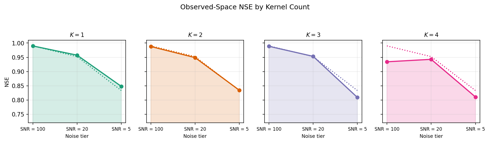
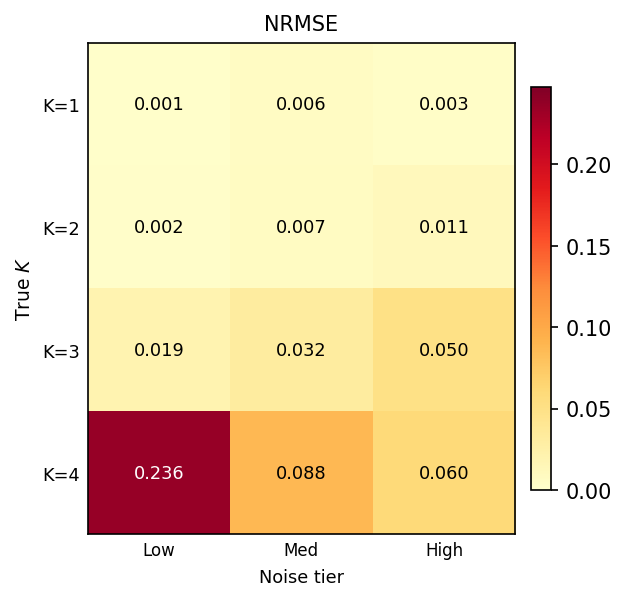
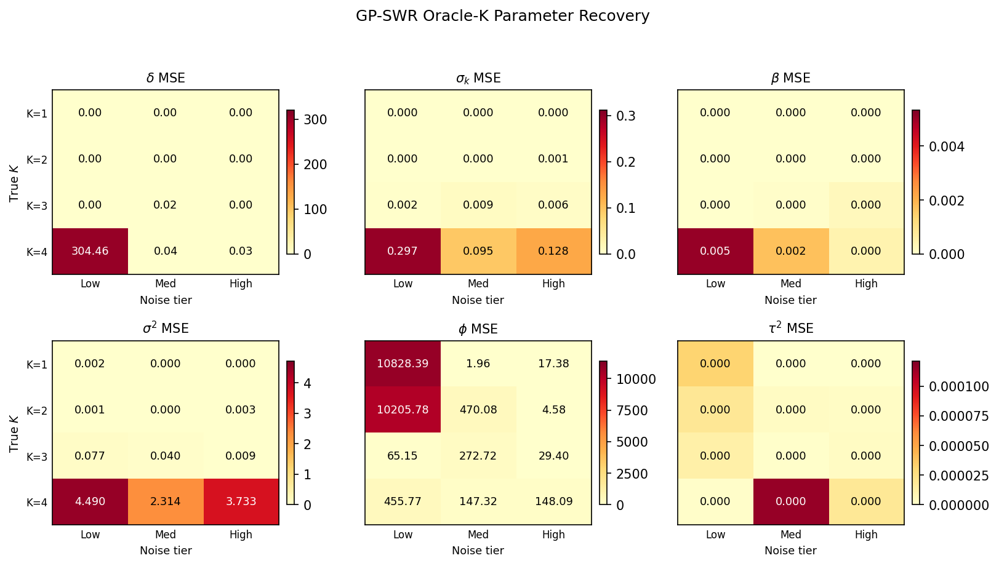

```{python}
#| include: false

import json
from pathlib import Path

root = Path(".")
output_dir = root / "output"
with open(output_dir / "simulation_recovery_grid.json") as f:
    SIM = json.load(f)

cfg = SIM["config"]
tbl = SIM["summary_table"]
```

## Purpose

- Oracle-$K$ synthetic recovery experiment for GP-SWR
- Training rainfall input: Big Sur training split
- Grid: `K_true ∈ {1,2,3,4}` × `SNR ∈ {100,20,5}`

## Setup

```{python}
#| output: asis

rows = [
    ("K values", ", ".join(str(k) for k in cfg["K_values"])),
    ("SNR tiers", ", ".join(f"{k}={v}" for k, v in cfg["snr_tiers"].items())),
    ("Reps per cell", cfg["reps"]),
    ("NNGP neighbors m", cfg["m"]),
    ("Matérn nu", cfg["nu"]),
    ("Optimizer maxiter", cfg["maxiter"]),
    ("Restarts", cfg["n_restarts"]),
    ("Seed", cfg["seed"]),
    ("Min mean-lag separation", cfg["min_mean_lag_separation"]),
    ("Max overlap", cfg["max_overlap"]),
    ("Kernel sampling", cfg["kernel_sampling"]),
    ("Fit mode", cfg["fit_mode"]),
]
print("| Item | Value |")
print("|:--|:--|")
for k, v in rows:
    print(f"| {k} | {v} |")
```

## Grid Summary

```{python}
#| output: asis

cols = [
    "K_true", "noise_tier", "target_snr", "nrmse_median", "nse_median", "nse_max",
    "delta_mse_median", "sigma_k_mse_median", "beta_mse_median",
    "cov_sigma_sq_mse_median", "cov_phi_mse_median", "cov_tau_sq_mse_median",
]
print("| " + " | ".join(cols) + " |")
print("|" + "|".join([":--"] * len(cols)) + "|")
for row in tbl:
    vals = []
    for c in cols:
        v = row[c]
        if isinstance(v, float):
            vals.append(f"{v:.4f}")
        else:
            vals.append(str(v))
    print("| " + " | ".join(vals) + " |")
```

## Plots

{width=100%}

{width=45%}

{width=100%}
